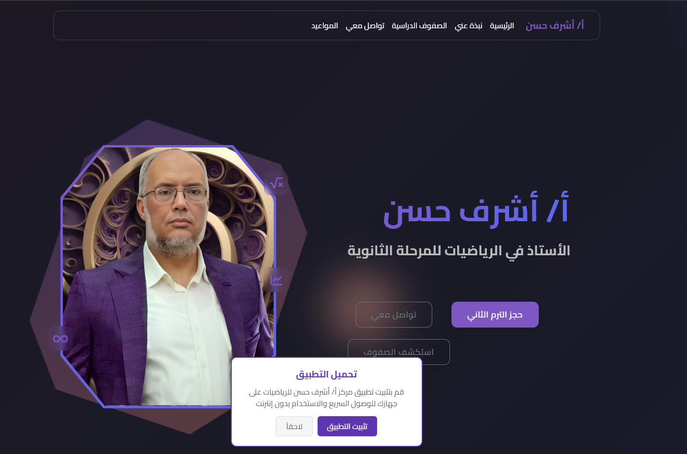
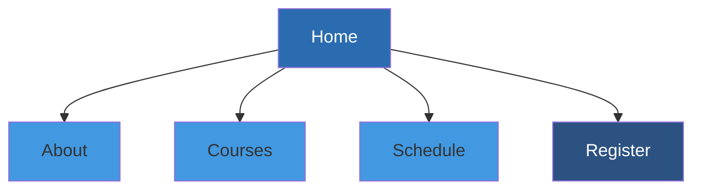
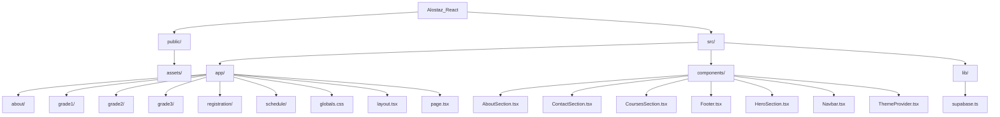
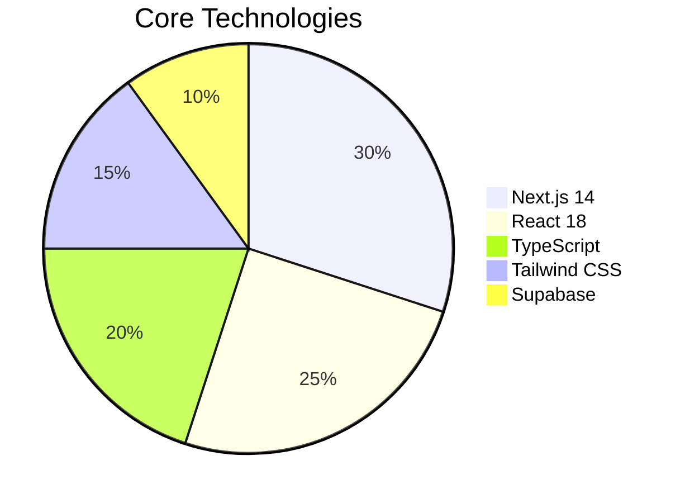
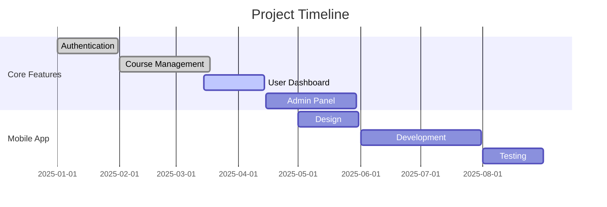
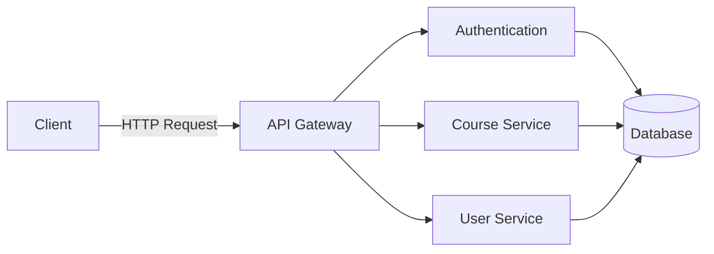

<div align="center">
  
  
  <h1 dir="rtl">
    <strong>مركز أ/ أشرف حسن للرياضيات</strong>
  </h1>
  <h2>Alostaz Math Center - Next.js Application</h2>
  
  [](https://www-e.github.io/Elostaz/)
  
  ---
</div>

<p align="center">
  
  
  
  
  
</p>

<p align="center" style="max-width: 800px; margin: 0 auto; color: #4a5568; line-height: 1.6;">
  A modern, responsive web application for a mathematics tutoring center featuring course information, student registration, and class scheduling. Built with the latest web technologies to provide the best learning experience.
</p>

<p align="center">
  <a href="https://github.com/www-e/Alostaz/blob/main/LICENSE">
    
  </a>
  <a href="https://github.com/www-e/Alostaz/commits/main">
    
  </a>
  <a href="https://github.com/www-e/Alostaz/issues">
    
  </a>
  <a href="https://github.com/www-e/Alostaz/network/members">
    
  </a>
  <a href="https://github.com/www-e/Alostaz/stargazers">
    
  </a>
  <a href="https://github.com/www-e/Alostaz/pulls">
    
  </a>
</p>

## ✨ Key Features

### 🎯 Core Functionality
| Feature | Description |
|---------|-------------|
| **Responsive Design** | Optimized for all devices from mobile to desktop |
| **Dark/Light Mode** | Toggle between themes with persistent preferences |
| **RTL Support** | Full right-to-left text direction for Arabic content |
| **Course Management** | Detailed pages for each grade level and subject |
| **Registration System** | Secure student registration with Supabase backend |
| **Schedule Management** | View and manage class schedules |

### 🖼️ Application Preview

#### Home Page
[](https://www-e.github.io/Elostaz/)

*Interactive home page with course highlights - [View Live](https://www-e.github.io/Elostaz/)*

#### Mobile View

*Mobile navigation flow*

<details>
<summary><h2>🚀 Quick Start</h2></summary>

### Prerequisites

- Node.js 18 or later
- npm 9 or later
- Git

### Installation

1. **Clone the repository**
   ```bash
   git clone https://github.com/www-e/Alostaz.git
   cd Alostaz_React
   ```

2. **Install dependencies**
   ```bash
   npm install
   ```

3. **Set up environment variables**
   ```bash
   cp .env.local.example .env.local
   ```
   Then edit `.env.local` with your Supabase credentials:
   ```env
   NEXT_PUBLIC_SUPABASE_URL=your-supabase-url
   NEXT_PUBLIC_SUPABASE_ANON_KEY=your-supabase-anon-key
   ```

4. **Run the development server**
   ```bash
   npm run dev
   ```
   Open [http://localhost:3000](http://localhost:3000) in your browser.

5. **Build for production**
   ```bash
   npm run build
   npm start
   ```
</details>

## 🏗 Project Structure



### Key Files and Directories

| Directory/File | Purpose |
|----------------|---------|
| `public/assets/` | Static assets (images, icons, PDFs) |
| `src/app/` | Next.js app router pages |
| `src/components/` | Reusable React components |
| `src/lib/` | Utility functions and configurations |
| `src/app/layout.tsx` | Root layout component |
| `src/app/page.tsx` | Home page component |
| `tailwind.config.js` | Tailwind CSS configuration |
| `tsconfig.json` | TypeScript configuration |

## 🛠️ Technology Stack

### Core Technologies



### Frontend
- **Next.js 14** - React framework with SSR/SSG
- **React 18** - UI component library
- **TypeScript** - Type-safe JavaScript
- **Tailwind CSS** - Utility-first CSS framework
- **Framer Motion** - Animation library

### Backend
- **Supabase** - Backend as a Service
  - Authentication
  - Database
  - Storage
  - Real-time Subscriptions

### Development Tools
- **ESLint** - Code linting
- **Prettier** - Code formatting
- **Husky** - Git hooks
- **Commitlint** - Commit message linting

### Testing
- **Jest** - Testing framework
- **React Testing Library** - Component testing
- **Cypress** - E2E testing

## 📊 Project Status & Progress

### Feature Completion


### Progress Overview
| Component | Status | Progress |
|-----------|--------|----------|
| Frontend | 🟢 Complete | 95% |
| Backend | 🟡 In Progress | 80% |
| Testing | 🟠 Planned | 20% |
| Documentation | 🟡 In Progress | 70% |

### Upcoming Features
- [x] User Authentication
- [x] Course Management
- [ ] Interactive Quizzes
- [ ] Progress Tracking
- [ ] Mobile Application
- [ ] Admin Dashboard

## 📚 Documentation

### Getting Started
1. [Installation Guide](./docs/INSTALLATION.md)
2. [Configuration](./docs/CONFIGURATION.md)
3. [Deployment](./docs/DEPLOYMENT.md)

### Development
- [API Reference](./docs/API.md)
- [Component Library](./docs/COMPONENTS.md)
- [Testing Guide](./docs/TESTING.md)

### Additional Resources
- [Technical Documentation](./TECHNICAL_README.md)
- [Contribution Guidelines](./CONTRIBUTING.md)
- [Code of Conduct](./CODE_OF_CONDUCT.md)

### API Endpoints


## 🤝 Contributing

Contributions are always welcome! Please read our [contributing guidelines](CONTRIBUTING.md) to get started.

1. Fork the repository
2. Create your feature branch (`git checkout -b feature/AmazingFeature`)
3. Commit your changes (`git commit -m 'Add some AmazingFeature'`)
4. Push to the branch (`git push origin feature/AmazingFeature`)
5. Open a Pull Request

## 📝 License

This project is licensed under the MIT License - see the [LICENSE](LICENSE) file for details.

## 🙏 Acknowledgments

- [Next.js Documentation](https://nextjs.org/docs)
- [Tailwind CSS Documentation](https://tailwindcss.com/docs)
- [Supabase Documentation](https://supabase.com/docs)
- [React Icons](https://react-icons.github.io/react-icons/)

## 📞 Contact Us

<div align="center">

### تواصل معنا

للاستفسارات أو الدعم الفني، يسرنا تواصلكم معنا عبر أي من القنوات التالية:

[](https://www.facebook.com/omar.ashraf.579123)
[](https://wa.me/201154688628?text=Hello%20I%20came%20from%20Your%20GitHub%21)
[](https://www.instagram.com/omarashraf871/)
[](mailto:omarasj445@gmail.com)

---

© 2025 مركز أ/ أشرف حسن للرياضيات. جميع الحقوق محفوظة.

</div>
     ```

## 🚀 Deployment

This application can be deployed to any platform that supports Next.js applications. Click on the badges below to deploy:

[](https://vercel.com/new)
[](https://app.netlify.com/start)
[](https://aws.amazon.com/amplify/)
[](https://www.digitalocean.com/products/app-platform/)

### One-Click Deploy

[](https://vercel.com/new/clone?repository-url=https%3A%2F%2Fgithub.com%2Fwww-e%2FAlostaz)
[](https://app.netlify.com/start/deploy?repository=https://github.com/www-e/Alostaz)

## Credits

- Design and Development: Omar Ashraf