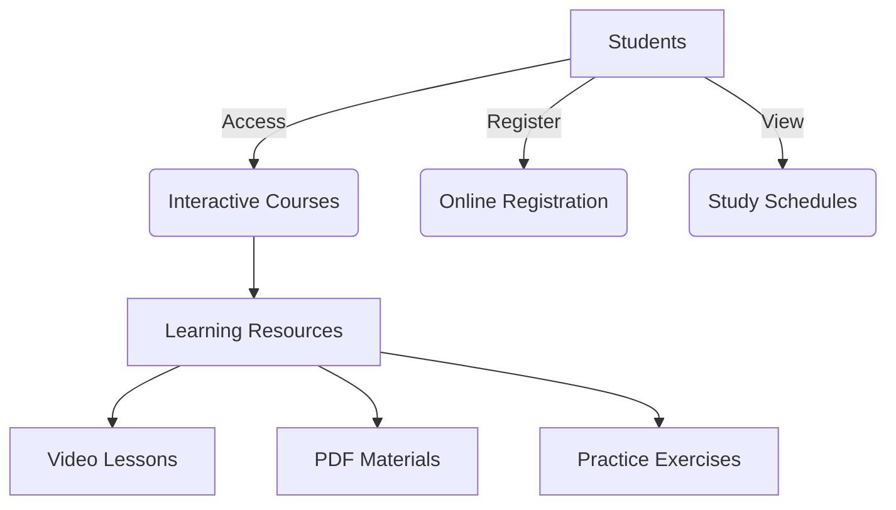
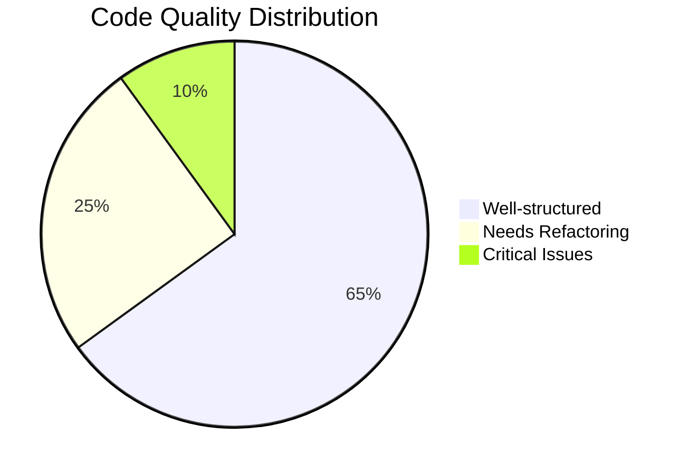
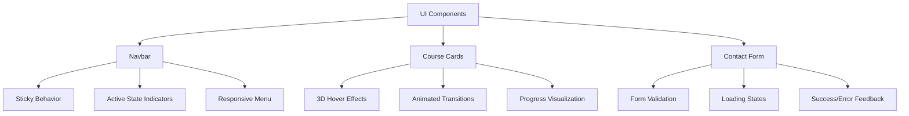
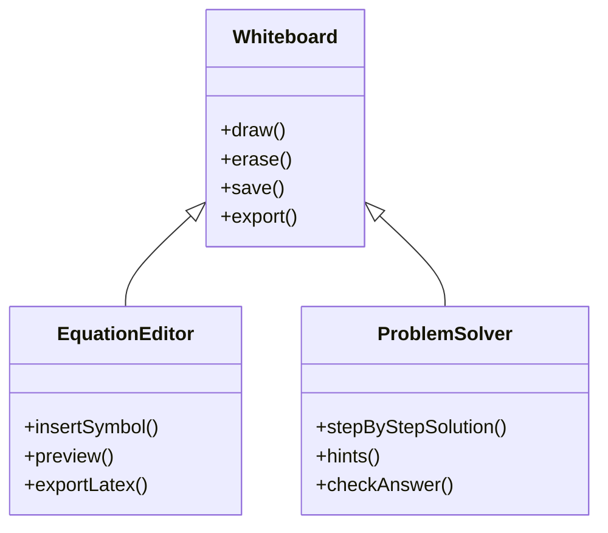
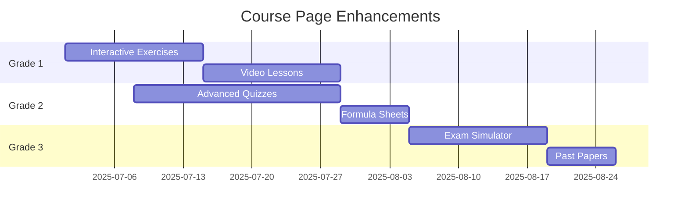
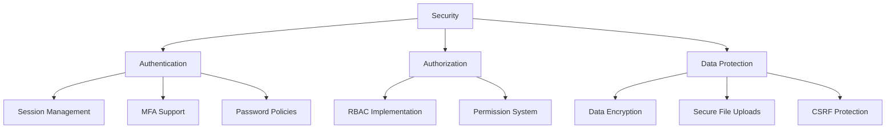
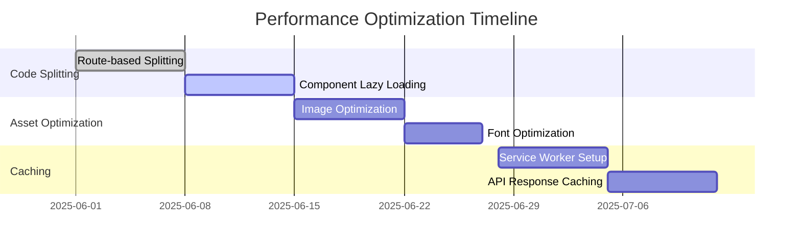
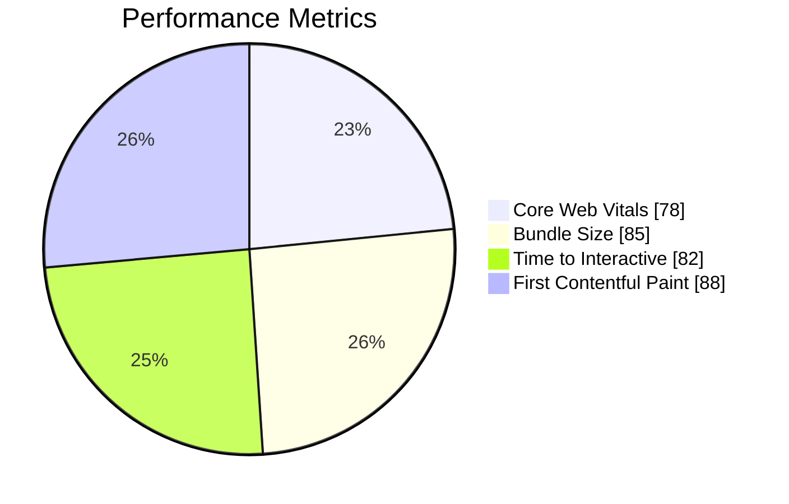

# 🎯 Alostaz Educational Center - Comprehensive Development Roadmap

  
  
  

## 🏛️ Project Overview
Alostaz is an advanced educational platform specializing in high school mathematics education. The platform offers a comprehensive learning experience with structured courses, student registration, and resource management, featuring a modern, responsive interface with full RTL support for Arabic language.

## 🔍 Codebase Health Analysis

### 🏆 Strengths
- **Modern Tech Stack**: Next.js 14 with TypeScript
- **Responsive Design**: Mobile-first approach with RTL support
- **Performance**: Good use of Next.js optimizations
- **Code Organization**: Well-structured component hierarchy
- **Theming**: Consistent use of CSS variables

### ⚠️ Critical Issues & Improvements

#### 1. Code Quality & Maintainability

- **Large Components**: Several components exceed 200+ lines
- **Type Safety**: Inconsistent TypeScript implementation
- **Code Duplication**: Similar logic across grade pages
- **Component Reusability**: Could be improved

#### 2. Performance Bottlenecks
- **Bundle Size**: Large due to full icon imports
- **Image Optimization**: Inconsistent use of Next.js Image component
- **Animation Performance**: Some animations may affect low-end devices

#### 3. Security Concerns
- **Input Sanitization**: Needs implementation
- **Rate Limiting**: Missing for API endpoints
- **CSRF Protection**: Not implemented

## 🚀 Development Roadmap

### 📅 Phase 1: Foundation & Core Features (Weeks 1-4)

#### 🔧 Code Quality & Architecture
- [ ] **Component Refactoring**
  - Break down large components (e.g., `AboutSection.tsx`)
  - Create reusable UI components
  - Implement consistent TypeScript patterns

- [ ] **State Management**
  - Evaluate need for state management library
  - Implement proper state organization
  - Add TypeScript interfaces for all data structures

#### 🎨 UI/UX Enhancements

#### Component-Specific Improvements

#### Visual Design Upgrades
- **Micro-interactions**
  - Button hover/click effects
  - Form field focus states
  - Loading animations
  - Success/error notifications

- **Accessibility**
  - ARIA attributes for all interactive elements
  - Keyboard navigation support
  - Reduced motion preferences
  - High contrast mode

- **Performance Optimizations**
  - Image lazy loading
  - Font display strategies
  - Animation performance
  - Bundle size reduction

#### Theme System
- [ ] Dark/Light mode transitions
- [ ] Custom theme variables
- [ ] High contrast mode
- [ ] Reduced motion mode

### 📚 Phase 2: Learning Experience (Weeks 5-8)

#### 🎓 Interactive Learning Tools

#### 📊 Progress & Analytics
- **Student Dashboard**
  - Performance heatmaps
  - Time tracking
  - Weak area identification
  - Study recommendations

- **Gamification**
  - Achievement badges
  - Progress milestones
  - Leaderboards (optional)
  - Streak tracking

#### 🎨 Enhanced Course Pages

### 🛠️ Phase 3: Infrastructure & Security (Weeks 9-12)

#### 🔒 Security Hardening

#### 🚀 Performance Optimization
- **Frontend**
  - Code splitting
  - Image optimization
  - Bundle analysis
  - Caching strategies
  - Service workers

- **Backend**
  - Database indexing
  - Query optimization
  - API response caching
  - Background jobs

#### 📱 Mobile Experience
- PWA Implementation
- Touch-friendly UI
- Offline capabilities
- Push notifications

#### 📝 Documentation & Onboarding
- Interactive component playground
- API documentation
- Video tutorials
- Developer guides

## 📊 Technical Improvements

### 🚀 Performance Optimization

### 🧪 Testing Strategy
- [ ] **Unit Testing**
  - Component testing with React Testing Library
  - Utility function tests
  - Test coverage reporting

- [ ] **Integration Testing**
  - User flows
  - Form submissions
  - API interactions

- [ ] **E2E Testing**
  - Critical user journeys
  - Cross-browser testing
  - Performance testing

## 📈 Success Metrics & KPIs

### Performance Dashboard

### Quarterly Targets
| Category               | Q2 2025 | Q3 2025 | Q4 2025 | Target |
|------------------------|---------|---------|---------|---------|
| Performance Score     | 75/100  | 85/100  | 95/100  | 95/100  |
| Accessibility         | 65/100  | 80/100  | 90/100  | 90/100  |
| Test Coverage         | 20%     | 60%     | 80%     | 80%     |
| Page Load Time        | 2.8s    | 2.0s    | 1.5s    | <1.5s   |
| Mobile Usability      | 70/100  | 85/100  | 95/100  | 95/100  |
| User Satisfaction     | 3.8/5   | 4.2/5   | 4.7/5   | 4.5/5   |

### Key Performance Indicators
- **Engagement**
  - Average session duration
  - Pages per session
  - Return visitor rate
  - Course completion rate

- **Technical**
  - Error rate
  - API response time
  - Crash-free sessions
  - Resource load times

- **Business**
  - User acquisition cost
  - Retention rate
  - Conversion rate
  - Customer lifetime value

## 📝 Documentation

### 📚 Developer Documentation
- [ ] Component API documentation
- [ ] Setup instructions
- [ ] Deployment guide
- [ ] Contribution guidelines

### 👥 User Documentation
- [ ] Getting started guide
- [ ] Feature documentation
- [ ] FAQ section
- [ ] Video tutorials

## 🔄 Continuous Improvement

### 📊 Monitoring & Analytics
- [ ] Error tracking
- [ ] Performance monitoring
- [ ] User behavior analysis
- [ ] A/B testing framework

### 🔄 Feedback Loop
- [ ] User feedback collection
- [ ] Regular code reviews
- [ ] Performance audits
- [ ] Security assessments

## 🚀 Development Roadmap

### 🏆 Phase 1: Core Platform Enhancement (Weeks 1-4)

#### 1. User Authentication & Authorization
- [ ] Implement Supabase Authentication
  - Email/password login
  - Social logins (Google, Facebook)
  - Password reset flow
  - Email verification
  - Session management

#### 2. Content Management System
- [ ] Migrate from Google Drive to Supabase Storage
- [ ] Implement file upload functionality
- [ ] Create content organization system
- [ ] Add search functionality

#### 3. Student Dashboard
- [ ] User profile management
- [ ] Course progress tracking
- [ ] Assignment submissions
- [ ] Notifications system

### 📚 Phase 2: Learning Experience (Weeks 5-8)

#### 1. Interactive Learning
- [ ] PDF viewer integration
- [ ] Video player with progress tracking
- [ ] Interactive exercises
- [ ] Quizzes and assessments

#### 2. Progress Tracking
- [ ] Student performance analytics
- [ ] Completion certificates
- [ ] Study time tracking
- [ ] Achievement badges

#### 3. Communication Tools
- [ ] In-app messaging
- [ ] Announcement system
- [ ] Discussion forums
- [ ] Live chat support

### 🛠️ Phase 3: Administration & Management (Weeks 9-12)

#### 1. Admin Panel
- [ ] User management
- [ ] Content moderation
- [ ] Analytics dashboard
- [ ] System settings

#### 2. Payment Integration
- [ ] Subscription system
- [ ] Payment gateway integration
- [ ] Invoicing
- [ ] Receipt generation

#### 3. Advanced Features
- [ ] Calendar integration
- [ ] Video conferencing
- [ ] Whiteboard functionality
- [ ] Mobile app planning

## 🔍 Technical Improvements Needed

### Performance Optimization
- [ ] Implement code splitting
- [ ] Optimize image loading with Next.js Image
- [ ] Add caching strategies
- [ ] Implement ISR for static pages
- [ ] Bundle size optimization

### SEO & Accessibility
- [ ] Add proper meta tags
- [ ] Implement structured data (Schema.org)
- [ ] Improve semantic HTML
- [ ] Add ARIA labels
- [ ] Keyboard navigation
- [ ] Screen reader optimization

### Testing Strategy
- [ ] Unit tests (Jest/React Testing Library)
- [ ] Integration tests
- [ ] E2E tests (Cypress/Playwright)
- [ ] Performance testing
- [ ] Cross-browser testing

### Security Enhancements
- [ ] Input sanitization
- [ ] CSRF protection
- [ ] Rate limiting
- [ ] Security headers
- [ ] Regular dependency updates

## 🛠️ Production Readiness

### Deployment Pipeline
- [ ] CI/CD with GitHub Actions
- [ ] Staging environment setup
- [ ] Production deployment process
- [ ] Rollback procedures

### Monitoring & Analytics
- [ ] Error tracking (Sentry)
- [ ] Performance monitoring
- [ ] User analytics
- [ ] Uptime monitoring

### Documentation
- [ ] API documentation
- [ ] Developer setup guide
- [ ] User guides
- [ ] Style guide
- [ ] Component documentation

## 📊 Technical Stack Details

### Frontend
- **Framework**: Next.js 14 (App Router)
- **Language**: TypeScript 5.x
- **Styling**: CSS Modules + CSS Custom Properties
- **State Management**: React Hooks + Context API
- **Form Handling**: React Hook Form
- **Animation**: Framer Motion + CSS Animations
- **Icons**: React Icons
- **Internationalization**: next-i18next (planned)

### Backend (Supabase)
- **Database**: PostgreSQL
- **Authentication**: Supabase Auth
- **Storage**: Supabase Storage
- **Realtime**: Supabase Realtime
- **Edge Functions**: Supabase Edge Functions

### DevOps
- **Version Control**: Git/GitHub
- **CI/CD**: GitHub Actions
- **Hosting**: Vercel
- **Monitoring**: Sentry, Vercel Analytics
- **Analytics**: Google Analytics, PostHog (planned)

## 🔄 Maintenance & Growth

### Regular Maintenance
- Monthly dependency updates
- Security patches
- Performance monitoring
- User feedback collection
- Content updates

### Growth Strategy
- Student referral program
- Teacher collaboration features
- Community building
- Marketing integration
- Partnership opportunities

---

*Last Updated: May 22, 2025*  
*Version: 1.0.0-beta*  
*Next Review: August 2025*
