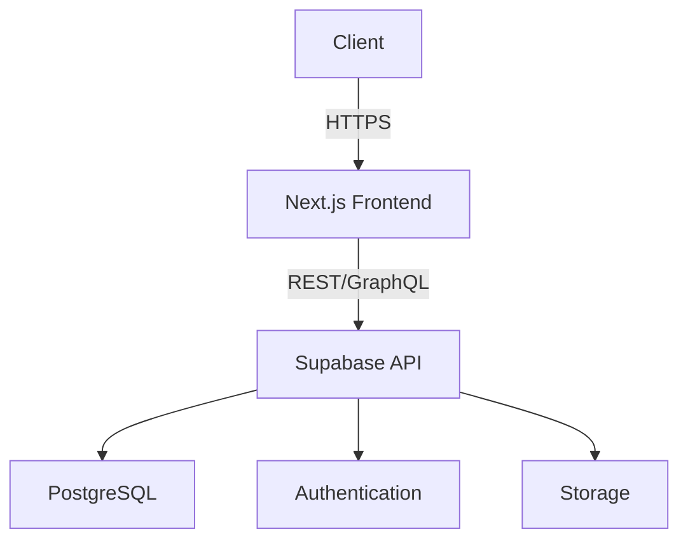

# FILE: system-architecture.md

# System Architecture

## Overview

The Alostaz platform follows a modern, modular architecture built with Next.js and Supabase. The system is designed to be scalable, maintainable, and easy to understand.

## High-Level Architecture



## Core Modules

1. **Frontend**
   - Built with Next.js 13+ (App Router)
   - TypeScript for type safety
   - Chakra UI for consistent theming
   - React Query for data fetching
   - Formik + Yup for form handling

2. **Backend**
   - Supabase for database and authentication
   - PostgreSQL for data storage
   - Row Level Security (RLS) for data protection
   - Storage for file uploads

3. **Authentication**
   - JWT-based authentication
   - Role-based access control (RBAC)
   - Email/password and social logins

## Directory Structure

```
src/
├── app/                    # App Router pages
├── components/             # Reusable UI components
│   ├── common/            # Common components
│   ├── forms/             # Form components
│   └── layout/            # Layout components
├── lib/                   # Utility functions
├── hooks/                 # Custom React hooks
├── types/                 # TypeScript type definitions
└── services/             # API service clients
```

## Data Flow

1. **Client-Side Data Fetching**
   - Components use React Query hooks to fetch data
   - Data is cached and automatically refetched when needed
   - Optimistic updates for better UX

2. **Server-Side Rendering**
   - Page-level data fetching with `getServerSideProps`
   - Static generation for public pages
   - Incremental Static Regeneration (ISR) for dynamic content

## Security Considerations

- All database queries use RLS policies
- Sensitive operations require authentication
- Rate limiting on API endpoints
- Input validation on both client and server
- Regular security audits and dependency updates
