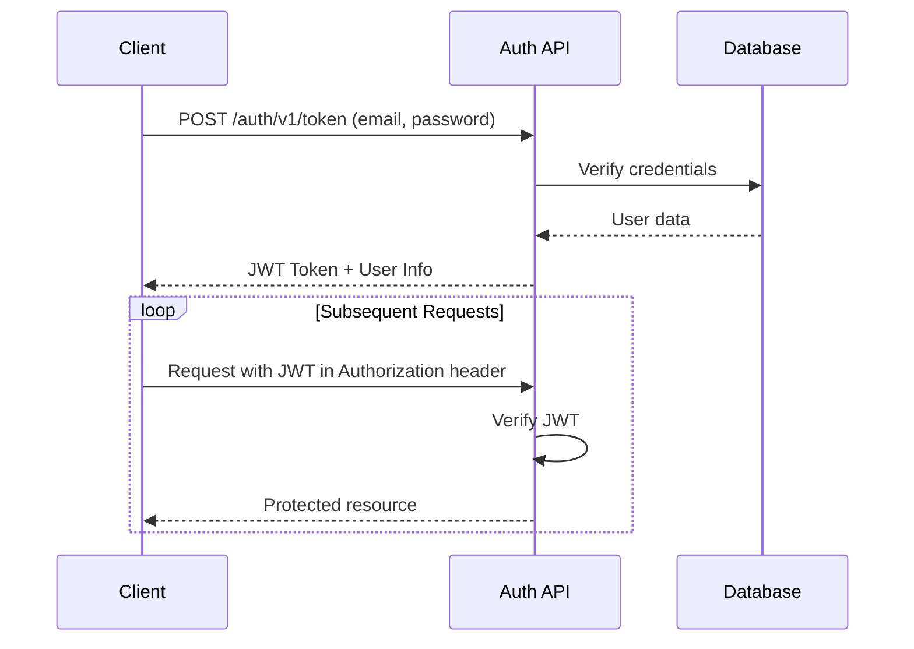

# FILE: authentication-authorization.md

# Authentication & Authorization

## Overview

This document covers the authentication and authorization system used in the Alostaz platform, including user roles, permissions, and security measures.

## Authentication Flow



## User Roles

| Role | Description | Permissions |
|------|-------------|-------------|
| `super_admin` | System administrator | Full access to all features and data |
| `admin` | Center administrator | Manage students, attendance, payments |
| `teacher` | Instructor | View and manage assigned groups |
| `student` | Student | View own data, submit homework |
| `parent` | Parent/Guardian | View child's progress and payments |

## JWT Structure

### Header
```json
{
  "alg": "HS256",
  "typ": "JWT"
}
```

### Payload
```json
{
  "sub": "123e4567-e89b-12d3-a456-426614174000",
  "email": "user@example.com",
  "role": "admin",
  "app_metadata": {
    "authorization": {
      "roles": ["admin"]
    }
  },
  "iat": 1516239022,
  "exp": 1516242622
}
```

## Password Policy

- Minimum 12 characters
- At least 1 uppercase letter
- At least 1 lowercase letter
- At least 1 number
- At least 1 special character
- Not in common password list
- Not similar to user's email or name

## Session Management

- Access token lifetime: 1 hour
- Refresh token lifetime: 7 days
- Automatic token rotation
- Token revocation on logout
- Session timeout after 24 hours of inactivity

## Password Reset Flow

1. User requests password reset
2. System sends email with reset link (valid for 1 hour)
3. User clicks link and enters new password
4. System validates and updates password
5. All active sessions are invalidated

## Multi-factor Authentication (Optional)

1. Enable MFA in user settings
2. Scan QR code with authenticator app
3. Enter verification code to confirm
4. Required for sensitive operations

## Security Headers

```http
Content-Security-Policy: default-src 'self';
X-Content-Type-Options: nosniff
X-Frame-Options: DENY
X-XSS-Protection: 1; mode=block
Strict-Transport-Security: max-age=31536000; includeSubDomains
Referrer-Policy: strict-origin-when-cross-origin
Permissions-Policy: camera=(), microphone=(), geolocation=()
```

## Rate Limiting

| Endpoint | Limit | Window |
|----------|-------|--------|
| /auth/v1/token | 5 | 15 minutes |
| /auth/v1/signup | 3 | 1 hour |
| /auth/v1/recover | 3 | 1 hour |
| /auth/v1/reset | 10 | 1 hour |

## Audit Logging

All authentication events are logged:

- Successful logins
- Failed login attempts
- Password changes
- MFA enrollment/changes
- Role changes
- Account lockouts

## Testing Authentication

```typescript
describe('Authentication', () => {
  it('allows login with valid credentials', async () => {
    const { user } = await loginAs('admin@example.com', 'securePassword123!');
    expect(user).toBeDefined();
    expect(user.role).toBe('admin');
  });

  it('rejects login with invalid credentials', async () => {
    await expect(loginAs('admin@example.com', 'wrong')).rejects.toThrow();
  });
});
```

## Troubleshooting

### Common Issues

1. **Invalid JWT**
   - Check token expiration
   - Verify token signature
   - Ensure proper token format

2. **Permission Denied**
   - Check user role
   - Verify RLS policies
   - Check route guards

3. **Rate Limited**
   - Wait for rate limit to reset
   - Implement exponential backoff
   - Contact admin if needed

## Best Practices

1. **Token Security**
   - Store tokens in HTTP-only cookies
   - Implement token rotation
   - Short token expiration

2. **Password Security**
   - Use strong hashing (Argon2id)
   - Enforce password policies
   - Monitor for breaches

3. **Session Security**
   - Invalidate sessions on logout
   - Implement idle timeout
   - Log security events
